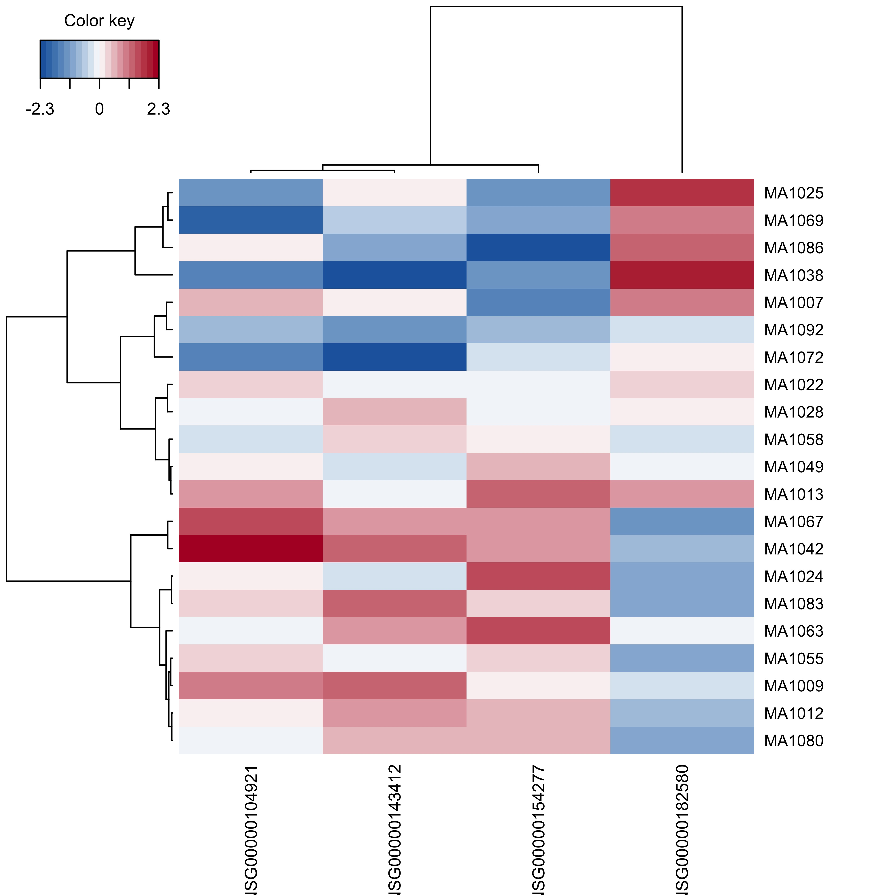

# Background

The purpose of this workflow is to determine which (if any) BAL and/or BE genes can predict eosinophils recruitment upon allergen challenge

# Setup

Load packages

```{r message=FALSE, warning=FALSE}
# Data manipulation and figures
library(tidyverse)
library(tidytext)
# RNAseq data
library(limma)
#Correlation
library(corrplot)
#PLS
library(mixOmics)
##  Be careful of version as this package is often not back compatible
#Enrichment MSigDB
# library(SEARchways)
# Print pretty table to knit file
library(knitr)
library(kableExtra)
options(knitr.kable.NA = '')

`%notin%` <- Negate(`%in%`)
```

Set seed

```{r}
set.seed(4389)
```

# Data
## Load data

```{r}
attach("data_clean/P337_BAL_data.RData")
attach("data_clean/P337_BE_data.RData")
attach("results/model_fitting.RData")
```

```{r echo=FALSE, results=FALSE}
#Load in saved tuning to speed Rmd
load("results/PLS/pls.tune.RData")
```

## Format data

Select pre (V4) samples from donors with both BAL and BE samples

```{r}
samps <- intersect(dat.BAL.abund.norm.voom$targets$donorID,
                   dat.BE.abund.norm.voom$targets$donorID)

targets.all <- dat.BAL.abund.norm.voom$targets %>% 
  bind_rows(dat.BE.abund.norm.voom$targets) %>% 
  filter(visit=="V4" & donorID %in% samps)
```

Select genes associated with eosinophils.

```{r}
bal.eos <- lm_eos_BAL$lm %>% 
  filter(variable=="EOS.pct" & FDR < 0.1) %>% 
  mutate(gene = paste0("BAL_",gene)) %>% 
  pull(gene)
be.eos <- lm_eos_BE$lm %>% 
  filter(variable=="EOS.pct" & FDR < 0.1) %>% 
  mutate(gene = paste0("BE_",gene)) %>% 
  pull(gene)

E.bal <- as.data.frame(dat.BAL.abund.norm.voom$E) %>% 
  rownames_to_column() %>% 
  mutate(rowname=paste0("BAL_",rowname)) %>% 
  pivot_longer(-rowname, names_to = "libID") %>% 
  inner_join(targets.all) %>% 
  dplyr::select(donorID, rowname, value) %>% 
  pivot_wider(names_from = donorID)

E.be <- as.data.frame(dat.BE.abund.norm.voom$E) %>% 
  rownames_to_column() %>% 
  mutate(rowname=paste0("BE_",rowname)) %>% 
  pivot_longer(-rowname, names_to = "libID") %>% 
  inner_join(targets.all) %>% 
  dplyr::select(donorID, rowname, value) %>% 
  pivot_wider(names_from = donorID)

E.all <- bind_rows(E.bal, E.be) %>% 
  filter(rowname %in% c(bal.eos,be.eos)) %>% 
  column_to_rownames() %>% 
  t() %>% as.data.frame() %>% 
  rownames_to_column() %>% 
  arrange(rowname) %>% 
  column_to_rownames() %>% 
  as.matrix()
```


# Partial least squares (PLS)

Regression mode: Y variable is deflated with respect to information extracted/modeled from local regression on X. Here, the goal is to predict Y from X (and vice versa).

Sparse: simultaneous variable selection in X and Y with LASSO penalization on each pair of loading vectors

<http://mixomics.org/methods/spls/>

## FeNO ~ gene expression

Format data

```{r message=FALSE}
X <- E.all[complete.cases(E.all),]
 
Y <- dat.BAL.abund.norm.voom$targets %>% 
  filter(visit=="V5" & donorID %in% rownames(X)) %>% 
  rownames_to_column() %>% 
  dplyr::select(donorID, EOS.pct) %>% 
  arrange(donorID) %>% 
  column_to_rownames("donorID")

##Check order
identical(rownames(X),rownames(Y))
save(X,Y, file = "results/PLS/PLS_data.RData")
```

Perform PLS regression.

```{r}
ncomp = 10
#PLS
pls_result <- pls(X, Y, ncomp = ncomp, mode = "regression")  
#SPLS
# spls_result <- spls(X, Y, ncomp = ncomp, mode = "regression") 
```

### Tuning

#### Number of components

Compute evaluation criteria for (s)PLS.

```{r eval=FALSE}
pls.Q2 <- perf(pls_result, validation = "Mfold", 
               folds = 10, nrepeat = 5,
                progressBar = FALSE)
save(pls.Q2, file="results/PLS/pls.Q2.RData")
```

```{r include=FALSE}
load("results/PLS/pls.Q2.RData")
```

Q2 total is the sum of the quality of fit over all variables. In general, components should only continue to be added if Q^2^ \< 0.0975. For visualization, the inverse log10 values are shown; thus, values greater than the red line indicate unnecessary components. Here, all Q^2^ are above the cutoff, indicating that no components are particularly good fits for Y. This often occurs with small sample sizes such as this.

```{r echo=FALSE}
mutate(as.data.frame(pls.Q2$measures$Q2.total$summary),
       method="PLS")  %>% 
  mutate(logMean = log2(-mean)) %>% 

  ggplot(aes(x=comp, y=logMean)) +
  geom_point() +
  geom_hline(yintercept = log2(0.0975), color="red") +
  facet_wrap(~method) +
  theme_classic() +
  scale_x_continuous(breaks=seq(1,10,1)) +
  labs(y= "Mean log2 Q2 total", x="Component")
```

Thus, axis loadings will be assessed as well. Looking at the axis loadings, component 1 explains the most variation (\~13%) followed by component 4 (\~12%). All other components contribute to a lesser extent (\<10%).

```{r echo=FALSE}
#axis loadings
as.data.frame(pls_result$prop_expl_var)%>% 
  mutate(Component = c(1:ncomp)) %>% 

  ggplot(aes(x=Component, y=X)) +
  geom_point() +
  theme_classic() +
  labs(y="Loading", title="PLS X loading") +
  scale_x_continuous(breaks=seq(1,10,1)) +
  geom_vline(xintercept = 4, color="red", lty="dashed")
```

```{r echo=FALSE}
ncompX <- 4
```

Taken together, `r ncompX` X components will be assessed, though likely only 1 component will be used in the final model.

#### Number of X variables

Compute error and fit metrics for X variables on each component. The goal is to minimize error while maximizing correlation.

* mean average error (MAE): average magnitude of absolute model error
* R2: correlation between predictions and observations

```{r eval=FALSE, echo=FALSE}
for(tune.measure in c('MAE','R2')){
  print(tune.measure)
  #X variables
  pls.tune.X <- tune.spls(X, Y,
                          ncomp = ncompX, #Determined above
                          test.keepX = c(1,seq(10,200,10)),
                          validation = "Mfold",
                          folds = 10, nrepeat = 100,
                          progressBar = TRUE,
                          measure=tune.measure)

  assign(paste("pls",tune.measure,"X", sep="."), pls.tune.X,
         envir=.GlobalEnv)
  
  rm(pls.tune.X)
}
```

Tuning suggests less than 20 features should be selected on component 1. Component 2 did not reach a minimum MAE as its values were still decreasing at the maximum number of features tested. Components 3 and 4 don't appear to improve the model.

```{r echo=FALSE, fig.height=3}
plot(pls.MAE.X, legend.position = 'topright')
plot(pls.R2.X, legend.position = 'topright')
```

Test 1 to 20 features in more detail.

```{r eval=FALSE, echo=FALSE}
for(tune.measure in c('MAE','R2')){
  print(tune.measure)
  #X variables
  pls.tune.X <- tune.spls(X, Y,
                          ncomp = 2, #Reduced due to first tuning
                          test.keepX = c(1:20),
                          validation = "Mfold",
                          folds = 10, nrepeat = 100,
                          progressBar = TRUE,
                          measure = tune.measure)
  assign(paste("pls.zoom",tune.measure,"X", sep="."), pls.tune.X,
         envir=.GlobalEnv)
  
  rm(pls.tune.X)
}

#Save all
save(list=ls(pattern="pls[.]"),
     file="results/PLS/pls.tune.RData")
```

Zooming in, we see that that the component 1 correlation suggested number of variables is `r pls.zoom.R2.X$choice.keepX[1]` and MAE suggested is `r pls.zoom.MAE.X$choice.keepX[1]`. 

Component 2 does not improve MAE or R2 when 1 feature is used. Given this and the lack of maximum R2 or minimum MAE achieved, we will tune the final model on 1 component.

```{r echo=FALSE, fig.height=3}
plot(pls.zoom.MAE.X, legend.position = 'topright')
plot(pls.zoom.R2.X, legend.position = 'topright')
```

### Run PLS

Using the parameters determined above, run the final PLS regression.

```{r}
choice.ncomp <- pls.zoom.MAE.X$choice.ncomp$ncomp
choice.keepX <- pls.zoom.MAE.X$choice.keepX[1:choice.ncomp]  

spls.tuned <- spls(X,Y, 
                 keepX = choice.keepX,
                 keepY = 1,
                 ncomp = choice.ncomp, 
                 mode = "regression")  

#Save
save(spls.tuned, file="results/PLS/SPLS.RData")
```

This results in the following variables..

```{r echo=FALSE, fig.width=8.5, fig.height=8.5}
as.data.frame(spls.tuned$loadings$X) %>% 
  rownames_to_column() %>% 
  mutate(space="X") %>% 
  pivot_longer(comp1, names_to = "comp") %>% 
  mutate(name = case_when(comp=="comp1"~
                            paste("X\nComponent 1 = ",
                                  round(spls.tuned$prop_expl_var$X[1]*100,digits=1), "%"))) %>% 
  separate(rowname, into=c("group","geneName"), sep="_") %>% 
  left_join(dat.BAL.abund.norm.voom$genes) %>% 
  mutate(rowname2 = paste(group, hgnc_symbol)) %>% 
  filter(abs(value)>0) %>% 
  
  ggplot(aes(x=reorder_within(rowname2, -value, 
                              list(name, space)), 
             y=value, fill=comp)) +
  geom_bar(position = position_dodge2(width = 0.9, preserve = "single"),
           stat="identity") +
  scale_x_reordered() +
  coord_flip() + 
  theme_classic() +
  facet_wrap(~name, scales="free", ncol=2) +
  labs(x="Selected variable", y="Loading", fill="") +
  theme(legend.position = "none") +
  geom_vline(xintercept = 0)
```

Correlations within PLS

```{r echo=FALSE}
cols <- colorRampPalette(c("#2166ac","white","#b2182b"))
cim(spls.tuned, comp = 1, margins = c(7, 7), 
    color=cols(20),
    save="png", name.save = "figs/P337_SPLS.feno")
```



Correlation of PCs

```{r echo=FALSE}
cor(spls.tuned$variates$X[, 1], spls.tuned$variates$Y[, 1]) %>% 
  kable() %>% 
  kable_styling(bootstrap_options = "striped", full_width = FALSE)
```

# R session

```{r}
sessionInfo()
```

***